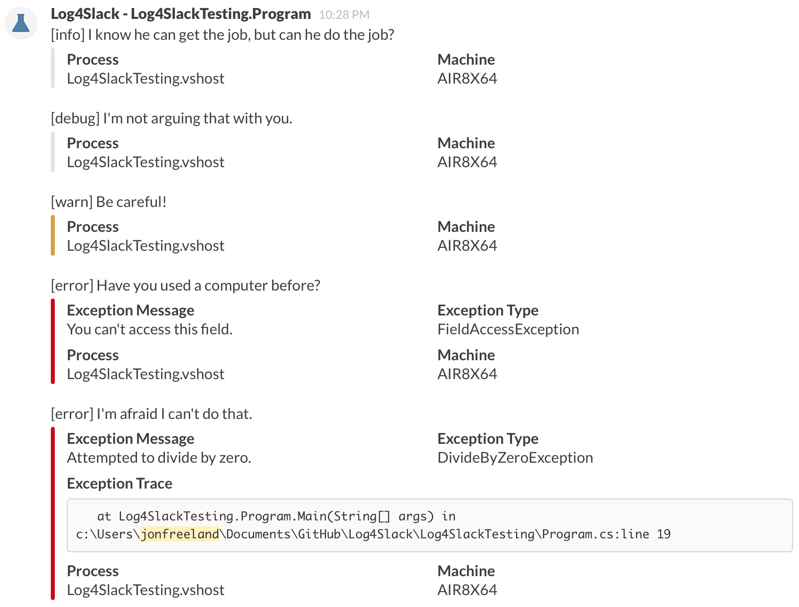

Log4Slack
=========

Simple, asynchronous [Slack](https://slack.com/) log4net appender. Grab the NuGet package [here](https://www.nuget.org/packages/Log4Slack/).



```xml
<appender name="SlackAppender" type="Log4Slack.SlackAppender, Log4Slack">
	<WebhookUrl value="https://{your company}.slack.com/services/hooks/incoming-webhook?token={your token}" /> <!-- Your Slack webhook URL -->
	<Channel value="#testing" /> <!-- Your Slack channel to post to -->
	<Username value="Log4Slack" /> <!-- The username to post as -->
	<IconUrl value="{your icon url}" />
	<IconEmoji value=":ghost:" /> <!-- Include an emoji to add a little character to your message -->
	<AddAttachment value="true" /> <!-- Include an attachment on the Slack message with additional details -->
	<AddExceptionTraceField value="true" /> <!-- If an exception occurs, add its trace as a field on the message attachment -->
	<UsernameAppendLoggerName value="true"/> <!-- Append the current logger name to the Slack username -->
	<Proxy value="http://proxy:8000"/> <!-- Use an outgoing http proxy -->
</appender>
```
